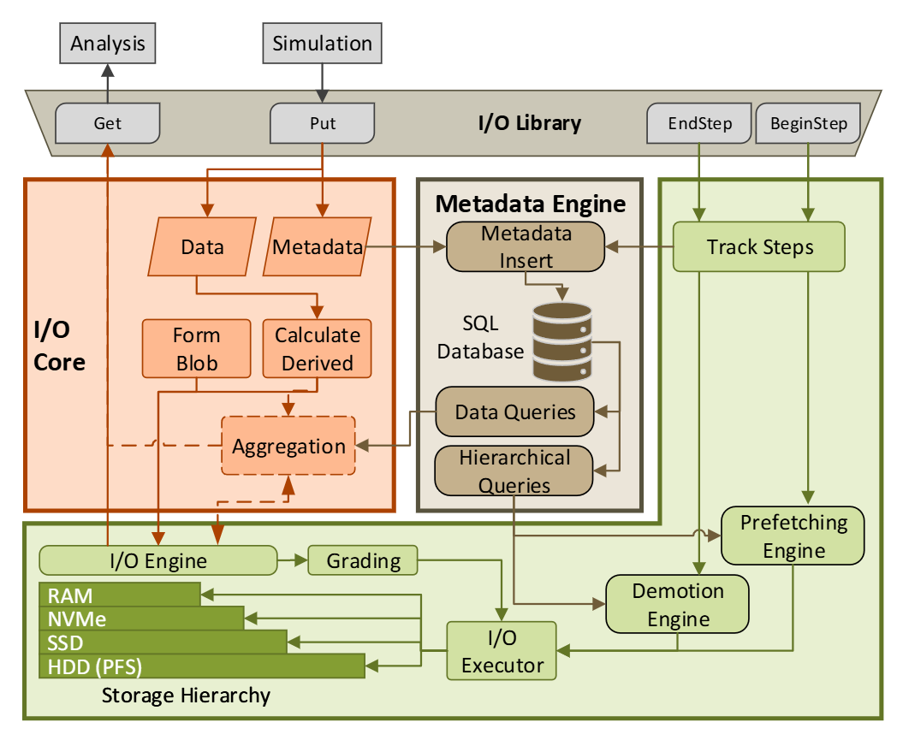

# COEUS-Adapter

**An ADIOS2 plugin that connects scientific applications to IOWarp** — giving
them multi-tiered I/O, in-situ derived variables, statistical triggers with
AI-driven steering, and live visualization, all without changing application
code.

Applications keep using the ordinary ADIOS2 API. COEUS intercepts their I/O
through the ADIOS2 plugin interface and redirects it into IOWarp's
**Context-Transfer-Engine (CTE)**, running on the **Chimaera** runtime.



---

## Contents

- [Overview](#overview)
- [Features](#features)
- [Installation](#installation)
- [Usage](#usage) — turn COEUS on for an ADIOS2 application
- [Derived Variables and Hash](#derived-variables-and-hash) — in-situ quantities, incl. `hash()`
- [Trigger-Render-Reason Pipeline](#trigger-render-reason-pipeline) — detect → stream → decide (Vigil)
- [Operators (Add-ons)](#operators-add-ons) — optional consumer tools (time-derivative)
- [In-Situ Visualization](#in-situ-visualization) — ParaView Catalyst / Fides
- [Supported Applications](#supported-applications)
- [Documentation](#documentation)

---

## Overview

COEUS-Adapter bridges ADIOS2 and IOWarp through the ADIOS2 plugin interface. An
application that already writes data with ADIOS2 selects the COEUS engine in its
ADIOS2 configuration and immediately gains:

- **Multi-tiered buffering** through CTE (RAM → NVMe → disk), managed by Chimaera.
- **In-situ analysis** — derived quantities, content hashing, statistical triggers,
  and live visualization computed *while the simulation runs*.
- **Metadata management** — a SQLite-backed catalog for query and analysis.

The single shippable artifact is `libhermes_engine.so`, an ADIOS2
`PluginEngineInterface` implementation, plus two Chimaera modules (`coeus_mdm`,
`rankConsensus`) that run inside the IOWarp runtime.

> **A note on naming.** The backbone I/O engine is now **clio-core** (IOWarp's
> Chimaera runtime + CTE) — Hermes is no longer used. The names `hermes_engine`,
> `PluginName=hermes`, and the `HermesEngine` class are retained from the
> original Hermes-based implementation so existing application configs keep
> working. See [SOURCE_CODE_ANALYSIS.md](SOURCE_CODE_ANALYSIS.md).

## Features

| Feature | What it gives you |
|---|---|
| **Multi-tiered I/O** | Efficient data movement across storage tiers via CTE. |
| **[Derived variables](#derived-variables-and-hash)** | In-situ `curl`, `Q-criterion`, `variance`, `add`, `mean`, and content **`hash`** — no post-processing pass. |
| **[Trigger-Render-Reason pipeline](#trigger-render-reason-pipeline)** | Watch a statistic each step, stream the flagged window to a viewer/AI agent, and let the agent steer the run (e.g. early-stop). |
| **[Add-on operators](#operators-add-ons)** | Opt-in consumer tools (e.g. 4th-order time derivatives) that never touch the engine. |
| **[In-situ visualization](#in-situ-visualization)** | Live, zero-copy ParaView Catalyst 2 + Fides, Inline or SST, with an experimental MCP AI agent. |
| **Metadata** | SQLite-backed catalog for query and analysis. |

## Installation

**Prerequisites:** [Spack](https://spack.io/), IOWarp (the `iowarp-core` package
= Chimaera runtime + CTE), and ADIOS2.

```bash
# 1. Add the IOWarp Spack repo and install dependencies
git clone https://github.com/iowarp/clio-core.git
spack repo add clio-core/installers/spack
spack install iowarp@main
spack install adios2

# 2. Load dependencies
spack load iowarp@main
spack load adios2

# 3. Build COEUS-Adapter
git clone https://github.com/grc-iit/coeus-adapter.git
cd coeus-adapter
mkdir build && cd build
cmake ..
make -j8
```

Useful CMake options: `-Dmeta_enabled=ON` (metadata features),
`-Ddebug_mode=ON` (function tracing), `-DCOEUS_ENABLE_CATALYST=ON`
([in-situ viz](#in-situ-visualization)), `-DCOEUS_ENABLE_OPERATORS=ON`
([add-on operators](#operators-add-ons)).

See the **[Installation Guide](install.md)** and **[Build Guide](BUILD_GUIDE.md)**
for details and troubleshooting.

## Usage

COEUS works as an ADIOS2 plugin engine — no application code changes. Point your
ADIOS2 XML at the `hermes` plugin:

```xml
<io name="SimulationOutput">
    <engine type="Plugin">
        <parameter key="PluginName" value="hermes" />
        <parameter key="PluginLibrary" value="hermes_engine" />
    </engine>
</io>
```

The IOWarp runtime (Chimaera + a CTE core pool) must be running before the
application starts — the [Jarvis pipelines](./test/jarvis/jarvis_coeus/pipelines)
launch and wire this up for you.

## Derived Variables and Hash

COEUS computes **ADIOS2 derived variables in-situ**, once per step, as data
flows through the engine. The producer declares them with the standard ADIOS2
API — COEUS reads the source fields from CTE, applies the expression, and stores
the result alongside the raw data:

```cpp
// variance / add (used by the trigger pipeline)
io.DefineDerivedVariable("derive/VarV", "x = V \n variance(x)",
                         adios2::DerivedVarType::StoreData);
// content hash of a field
io.DefineDerivedVariable("derive/hashV", "x = V \n hash(x)",
                         adios2::DerivedVarType::StoreData);
```

Supported operations include `curl`, `magnitude`, `variance`, `add`, `mean`
(custom), and **`hash`**.

### `hash()`

`hash()` is a derived-variable operation for content hashing / deduplication of
floating-point snapshots. Importantly, **it is implemented inside ADIOS2**
(the state-diff-enabled ADIOS2 fork, using Kokkos + DataStates state-diff) — so
COEUS reaches it through the same derived-variable path as everything else and
links **no** extra libraries. To enable it you only define the derived variable
above and build against the state-diff ADIOS2 fork.

➡️  **See [addons/HASH.md](addons/HASH.md)** for the full explanation, the
in-tree `adios_hashing` example, and the RECUP background.

## Trigger-Render-Reason Pipeline

*(Also called **Vigil**.)* A closed loop that turns a running simulation into a
self-steering one — **detect an event, stream it out, and decide what to do**:

1. **Trigger** — every step, the engine evaluates a global statistic over a
   variable (collective across ranks). When it crosses a threshold (or a
   baseline ratio, or *collapses* back down), the step is flagged.
2. **Render** — the flagged window (the firing step + a few more) is streamed
   over ADIOS2 **SST** to an external consumer: a ParaView/Catalyst viewer
   and/or an AI agent.
3. **Reason** — the AI agent inspects the streamed steps and issues a verdict —
   e.g. calls the MCP tool `fire_stop_simulation`, which writes a `.stop` flag
   the simulation polls, halting the run early.

### Trigger types

Selected with the `TriggerType` engine parameter:

| `TriggerType` | Statistic | Typical use |
|---|---|---|
| `variance` (default) | Exact pooled global variance of `TriggerVariable` | Gray-Scott pattern collapse |
| `mean` | N_b-weighted global mean of a derived per-block mean | LAMMPS kinetic temperature (`mean(|v|²) ≈ 3T*`) |
| `dissipation` | Two-stage Yellow/Red numerical-dissipation metric | Xcompact3d TGV (numerical vs. physical dissipation) |

A **collapse-warning** mode (`TriggerWarnOnCollapse=true`) *arms* when the
statistic rises past a baseline ratio (structure formed) and *warns* when it
falls back down (the field is homogenising toward blank) — the agent then issues
the fire verdict.

### Configuration

Triggers are configured as engine parameters in the ADIOS2 XML. A minimal
variance trigger:

```xml
<engine type="Plugin">
    <parameter key="PluginName" value="hermes"/>
    <parameter key="PluginLibrary" value="hermes_engine"/>

    <parameter key="TriggerType"          value="variance"/>
    <parameter key="TriggerVariable"      value="derive/VarV"/>  <!-- variance(V) -->
    <parameter key="TriggerThreshold"     value="0"/>            <!-- 0 disables absolute test -->
    <parameter key="TriggerBaselineRatio" value="20"/>           <!-- fire at 20x first-step baseline -->
    <parameter key="TriggerInspectSteps"  value="4"/>            <!-- stream 4 steps on fire -->
    <parameter key="TriggerRefire"        value="false"/>
    <parameter key="TriggerLogFile"       value="trigger_log.jsonl"/>
</engine>
```

Key knobs: `TriggerVariable`, `TriggerThreshold`, `TriggerBaselineRatio`,
`TriggerInspectSteps`, `TriggerRefire`, `TriggerWarnOnCollapse` +
`TriggerCollapseThreshold` / `TriggerCollapseBaselineRatio`, and the dissipation
set (`TriggerKEVariable`, `TriggerEnstrophyVariable`, `TriggerNu`,
`TriggerOutputDt`, `TriggerYellow/RedFraction`, `TriggerYellow/RedNuRatio`).

### Learn more / try it

- **[docs/BUILD_AND_RUN_GRAY_SCOTT.md](docs/BUILD_AND_RUN_GRAY_SCOTT.md)** — full
  walkthrough, including the collapse-warning → agent → early-stop demo (§7).
- **[test/real_apps/gray-scott/VARIANCE_TRIGGER.md](test/real_apps/gray-scott/VARIANCE_TRIGGER.md)** — trigger config reference.
- **[Ready-to-run pipeline](test/jarvis/jarvis_coeus/pipelines/gray-scott-warn-collapse.yaml)** —
  `jarvis ppl load yaml <file> && jarvis ppl run`.
- **[test/insitu_agent](./test/insitu_agent)** — the AI agent (render + reason stages).

## Operators (Add-ons)

Optional, **opt-in** tools that add computation *without touching the engine* —
`src/hermes_engine.cc` is unchanged whether they are built or not. They run as
standalone **CTE consumers**: they attach to the same CTE pool and read the
per-step blobs the engine already wrote (`step_<N>_rank<r>` tags), out-of-band.

- **`coeus_tderiv`** — 4th-order centered **time derivatives** (`dp/dt`,
  `d²p/dt²`) over a 5-step sliding window. (Time derivatives need cross-step
  history, which an ADIOS2 derived variable cannot express — hence a consumer
  rather than a derived variable.)

Build them with:

```bash
cmake .. -DCOEUS_ENABLE_OPERATORS=ON
make coeus_tderiv
```

➡️  **See [addons/README.md](addons/README.md)** for usage, offline/online
modes, and the design rationale. (`hash()` is *not* here — it is a
[derived variable](#derived-variables-and-hash); see [addons/HASH.md](addons/HASH.md).)

## In-Situ Visualization

COEUS can drive live, zero-copy visualization while a simulation runs, using
[ParaView Catalyst 2](https://catalyst-in-situ.readthedocs.io/) with
[Fides](https://fides.readthedocs.io/) to read ADIOS2 data into ParaView
pipelines — no per-application adaptor code.

- **Inline mode (single-node)** — data pointers are passed in-process to
  ParaView's Fides reader via the ADIOS2 Inline engine.
- **SST streaming mode (multi-node)** — data is streamed over ADIOS2 SST to an
  external ParaView/Catalyst reader, decoupling simulation and visualization.
- **In-situ AI agent (experimental)** — an AI agent drives ParaView through MCP
  tools to autonomously explore live data — see [test/insitu_agent](./test/insitu_agent).

Build with `-DCOEUS_ENABLE_CATALYST=ON` (or let CMake auto-detect Catalyst),
then point your ADIOS2 XML at a Fides `DataModel` JSON and a Catalyst `Script`.
See the [Gray-Scott](./test/catalyst_gray_scott) and
[Incompact3D](./test/catalyst_Incompact3D) in-situ examples.

## Supported Applications

| Application | Directory | Derived Quantities | In-Situ Viz |
|---|---|---|---|
| WRF (Weather Forecasting) | [wrf](./test/jarvis/jarvis_coeus/jarvis_coeus/wrf) | Hash | – |
| LAMMPS (Molecular Dynamics) | [lammps](./test/jarvis/jarvis_coeus/jarvis_coeus/lammps) | Hash, Mean (trigger) | – |
| Gray-Scott (Reaction-Diffusion) | [adios2_gray_scott](./test/jarvis/jarvis_coeus/jarvis_coeus/adios2_gray_scott) | Curl, Add, Variance, Hash | ✓ Catalyst/Fides + AI agent |
| Incompact3d | [Incompact3d](./test/jarvis/jarvis_coeus/jarvis_coeus/Incompact3d) | Q-criterion | ✓ Catalyst/Fides |
| OpenFOAM | [openfoam](./test/jarvis/jarvis_coeus/jarvis_coeus/openfoam) | – | – |

## Documentation

- [Installation Guide](install.md) — detailed setup instructions
- [Build Guide](BUILD_GUIDE.md) — dependencies, CMake options, troubleshooting
- [Source Code Analysis](SOURCE_CODE_ANALYSIS.md) — architecture and the clio-core dependency
- [Gray-Scott Build & Run](docs/BUILD_AND_RUN_GRAY_SCOTT.md) — end-to-end trigger/agent walkthrough
- [Add-on Operators](addons/README.md) · [Hash](addons/HASH.md) — optional operators and hashing
- [Test Applications](./test/) — example applications and integration tests

## Acknowledgments

Developed with support from the Department of Energy (DOE) under award
DOE ASCR Award DE-SC0023263.
