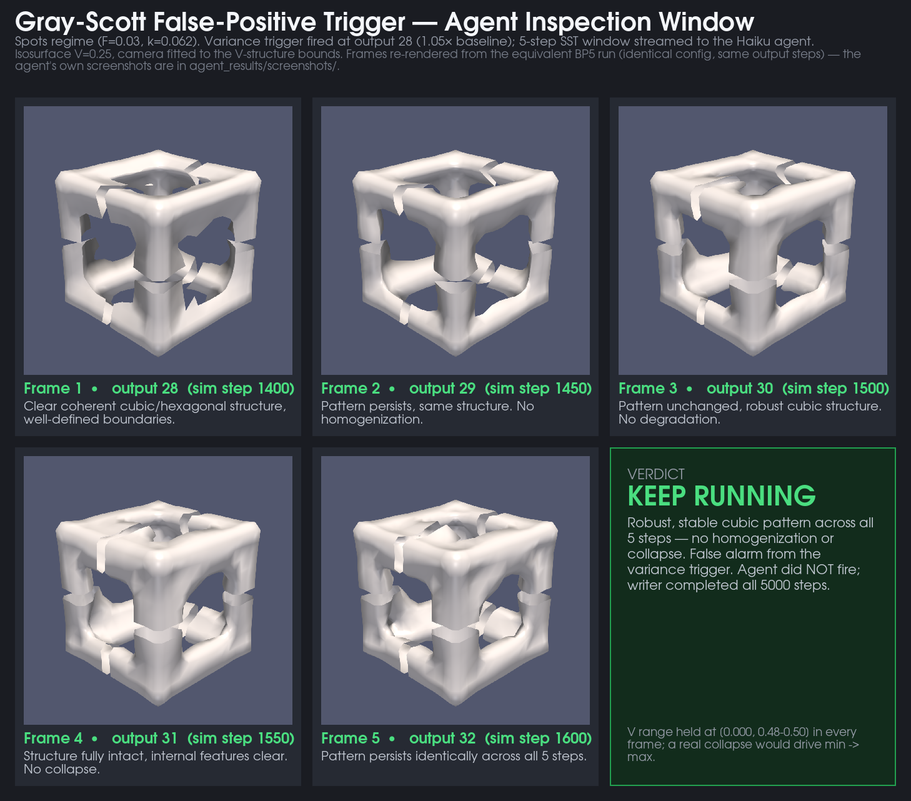

# Gray-Scott False-Positive Trigger Case

This case demonstrates the **agent-in-the-loop guard against a false-alarm trigger**: the
cheap statistical variance trigger fires on a perfectly healthy simulation, the AI agent
inspects the streamed frames, recognizes the pattern is intact, and **declines to stop the
run**. It is the complement of the collapse case in [`VARIANCE_TRIGGER.md`](VARIANCE_TRIGGER.md),
where the agent *does* fire because the field has genuinely homogenized.



*The five frames of the fired window, isosurface `V=0.25` with the camera fitted to the
V-structure bounds (the pattern occupies only ~20% of the `64³` domain per axis, so a
domain-framed camera renders it too small to read). Re-rendered from the equivalent BP5
run — identical config, same output steps; the agent's own screenshots are unmodified in
`agent_results/screenshots/`.*

## Why it false-alarms

The run uses the Gray-Scott **spots regime** (`F=0.03`, `k=0.062`). Here the V field forms a
persistent, localized reacting structure (the hollow cubic shell above) and **never
homogenizes** — its pooled variance only creeps to ~1.05–1.2× baseline. Configuring the
rising-edge trigger with `trigger_baseline_ratio=1.05` makes it deliberately over-sensitive,
so it fires on that healthy transient. That firing is the false positive by construction.

## Configuration

Pipeline `coeus-gray-scott`, single node, engine `hermes_derived`, trigger on `derive/VarV`:

```
L=64 nprocs=4 ppn=4 F=0.03 k=0.062 dt=1.0 steps=5000 plotgap=50 noise=0.01
engine=hermes_derived trigger=true
trigger_threshold=0            # disable absolute test; fire on ratio alone
trigger_baseline_ratio=1.05    # over-sensitive rising edge -> false alarm
trigger_inspect_steps=5        # stream a 5-step window to the agent
```

> **Note:** `trigger_baseline_ratio=1.08` is unreliable for this regime — the spots variance
> hovers so close to 1.08× that some noise draws never cross it. **Use 1.05.**

## What happened

1. **Trigger FIRED (the false alarm)** — from `trigger_log.jsonl`:
   ```json
   {"event":"trigger_fired","step":28,"variable":"derive/VarV","stat":"variance",
    "value":0.000382006,"baseline":0.000362181,"baseline_ratio":1.05,"inspect_steps":5}
   ```
   Variance 3.82e-4 vs baseline 3.62e-4 = 1.05× → fires at output 28, opens a 5-step SST
   window (outputs 28–32) streamed to the agent.

2. **Agent inspected the frames** — Haiku (`claude-haiku-4-5`) called `get_streaming_status`,
   then 5× (`advance_step` + `get_screenshot`). Every frame (above) showed the same robust
   cubic/hexagonal V-isosurface — no homogenization.

3. **Verdict: KEEP RUNNING** — the agent did **not** call `fire_stop_simulation`:
   > The V field shows a robust, stable cubic/hexagonal pattern with well-defined internal
   > structure across all 5 steps with no sign of homogenization or collapse. This is a false
   > alarm from the variance trigger.

4. **Simulation correctly left alone** — no `.stop` flag written, zero "halting early" lines,
   writer reached `Simulation at step 5000 writing output step 100` (all 5000 steps).
   Agent cost: 11 tool calls, 5 screenshots, 12 LLM calls, ~93 s, **~$0.09**.

## Frames

| Frame | Output step | Sim step | V range at render | Agent's note |
|-------|-------------|----------|-------------------|--------------|
| 1 | 28 | 1400 | [0.000, 0.494449] | Clear coherent cubic/hexagonal structure, well-defined boundaries. |
| 2 | 29 | 1450 | [0.000, 0.480069] | Pattern persists, same structure. No homogenization. |
| 3 | 30 | 1500 | [0.000, 0.493554] | Pattern unchanged, robust cubic structure. No degradation. |
| 4 | 31 | 1550 | [0.000, 0.496816] | Structure fully intact, internal features clear. No collapse. |
| 5 | 32 | 1600 | [0.000, 0.492100] | Pattern persists identically across all 5 steps. → **VERDICT: KEEP RUNNING** |

V ranges are the bridge's own per-step readings (`aw_bridge.log`) and are the quantitative
form of the verdict: max holds at ~0.48–0.50 and min stays at exactly 0 throughout. A
genuine collapse drives min → max.

## Artifacts

Run directory: `/mnt/common/hxu40/gray_scott_cases/false_alarm_run/`

| File | Contents |
|------|----------|
| `run_false_alarm_agent.sh` | Orchestrator: pvserver → jarvis writer → `--paused` bridge → Haiku agent + the neutral "trigger can false-alarm; your job is the verdict" prompt. |
| `aw_agent.log` | Full tool-by-tool agent reasoning and the KEEP RUNNING verdict. |
| `aw_writer.log` | Writer log; confirms fire + completion to step 5000, no early halt. |
| `agent_results/screenshots/agent_0001..0005.png` | The 5 source frames composited above. |
| `agent_results/token_usage.json` | Cost / tool-call accounting. |
| `.../jarvis_coeus.adios2_gray_scott/trigger_log.jsonl` | The `trigger_fired` event (top line). |
| `pv3d_zoom.py` | Re-renders the window with the camera fitted to the contour bounds (two passes: union the bounds over the window, then render with that fixed camera). |
| `make_sheet.py` | Composes the contact sheet above from those frames (pvbatch; VTK FreeType text, stdlib zlib PNG writer). |
| `frames_zoom/` | The 1000×1000 zoomed frames the sheet is built from. |

Regenerate the figure with:

```bash
pvbatch pv3d_zoom.py /mnt/common/hxu40/gray_scott_cases/F0.03_k0.062_spots/out.bp \
        frames_zoom 0.25 28 32 1000
pvbatch make_sheet.py frames_zoom false_positive_contact_sheet.png
```

> `pvbatch` needs a clean `PYTHONPATH` (`env -u PYTHONPATH`) — the spack ADIOS2/numpy
> entries on it shadow ParaView's own numpy and break the import.

*Frame labels (output steps 28–32) reflect the fired window (`fire_step=28`,
`inspect_steps=5`); the agent's own log numbers them 1–5 as stream-local indices.*
